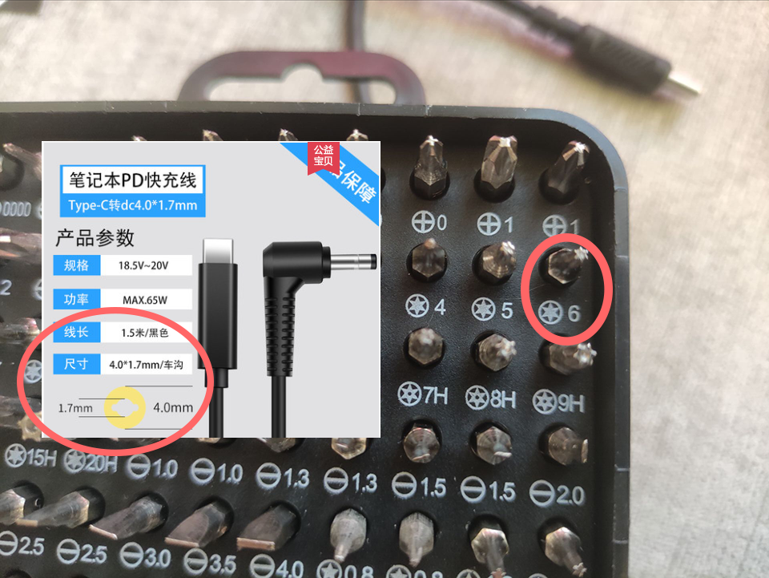

# Lenovo IdeaPad S540-14IML Hackintosh

Model：Lenovo IdeaPad S540-14IML - Type 81NF

| Item                | Status |                         Details                         |
| :-------------------- | :------: | :-------------------------------------------------------: |
| 💻 Computer model   |   ✅   |       Lenovo IdeaPad S540-14IML 2019 (Type 81NF)       |
| 🌌 OS Version       |   ✅   |                    Monterey/Ventura (13.3 & 13.5 ⚠️ PLEASE SKIP 13.4 ⚠️)                    |
| 🎛️ CPU            |   ✅   |            Intel Core i5-10210U / i7-10510U            |
| 🎛️ Motherboard    |   ✅   |                    Lenovo 5B20W78206                    |
| 🖐️ Fingerprint    |   ⛔   |         Synaptics - Fingerprint will never work         |
| 🎥 GPU              |   ⛔   |         Nvidia GeForce MX250 (Some models only)         |
| 🎥 iGPU             |   ✅   |                      Intel UHD 620                      |
| 💳 Memory           |   ✅   |     Internal 4GB 2666 + Changeable 8GB 2666 memory     |
| 💽 Disks            |   ✅   | Lenovo SSD 256G PCIe 2280 UMIS / Samsung SSD PM991 256G |
| 🖥️ Screen         |   ✅   |          AUO353D/LGD05EC (14-inches) 1920x1080          |
| 🔊 Audio Card       |   ✅   |                     Conexant CX8070                     |
| 🌐 Wireless         |   ✅   |     Replaced Atheros card with Broadcom BCM94360NG     |
| 🦷 Bluetooth        |   ✅   |                       BCM94360NG                       |
| 🗂️ SD card reader |   ✅   |         O2 Micro（working）/ Realtek (working）         |
| 🖐️ TrackPad       |   ✅   |             Works in GPIO mode with Pin=50             |
| 📺 HDMI             |   ✅   |        Able to output 4k@30fps, same as windows        |
| 📸 Camera           |   ✅   |          It's pretty easy to drive USB camera          |
| 😴 Sleep            |   ✅   |                  Support native sleep.                  |

## Current Status：

* 🌌 OS Version：Monterey / Ventura (Works well under 13.3 & 13.5, ⚠️ DO NOT USE IN 13.4 ⚠️)
* 🔊 Audio Card：Success with layout-id 15, no plosive Headsets with Microphone
* ⬇️ [Download](https://github.com/mandresve/Lenovo-IdeaPad-S540-Hackintosh/releases)

## Related models

* [Lenovo-XiaoXin-Air-14IML (i5-10210U/i7-10510U)](https://github.com/lietxia/XiaoXinAir14IML_2019_hackintosh)
* [Lenovo-Ideapad-S540-15IML (i5-10210U)](https://github.com/3ig/IdeaPad-S540-15IML-hackintosh)
* [Lenovo-Ideapad-S540-15IML (i5-10210U)](https://github.com/ayush5harma/IdeaPad-S540-Hackintosh)
* [Lenovo-Ideapad-S540-15IWL (i5-8265U)](https://github.com/IvanAleksandrov94/Lenovo-s340-s540-Big-Sur-OpenCore-i5-8265u)
* [Lenovo-Ideapad-S540-14IML (i5-10210U)](https://github.com/marianopela/Lenovo-Ideapad-S540-14IML-Hackintosh)
* [Lenovo-Ideapad-S540-14IWL (i5-8265U)](https://github.com/Hasodikis/Lenovo-Ideapad-s540-14IWL---Hackintosh)
* [Lenovo-Ideapad-S540-14IML (i5-10210U / i7-10510U)](https://github.com/mandresve/Lenovo-IdeaPad-S540-Hackintosh)

## BIOS

2022/05/13 BIOS Version: CKCN19WW https://download.lenovo.com/consumer/mobiles/ckcn19ww.exe

Details

2022/05/13 BIOS Version: CKCN19WW http://newdriverdl.lenovo.com.cn/newlenovo/alldriversupload/94976/BIOS-CKCN19WW.exe  
2022/03/18 BIOS Version: CKCN18WW http://newdriverdl.lenovo.com.cn/newlenovo/alldriversupload/92231/BIOS-CKCN18WW.exe  
2021/07/23 BIOS Version: CKEC17WW http://newdriverdl.lenovo.com.cn/newlenovo/alldriversupload/83713/BIOS-CKCN17WW.exe  
2021/01/18 BIOS Version: CKCN16WW http://newdriverdl.lenovo.com.cn/newlenovo/alldriversupload/78312/BIOS-CKCN16WW.exe  
2020/07/24 BIOS Version: CKCN15WW http://newdriverdl.lenovo.com.cn/newlenovo/alldriversupload/73409/BIOS-CKCN15WW.exe  
2020/06/22 BIOS Version: CKCN14WW http://newdriverdl.lenovo.com.cn/newlenovo/alldriversupload/72386/BIOS-CKCN14WW.exe  
2019/12/16 BIOS Version: CKCN12WW http://newdriverdl.lenovo.com.cn/newlenovo/alldriversupload/67169/BIOS-CKCN12WW.exe  
2019/08/08 BIOS Version: CKCN11WW http://newdriverdl.lenovo.com.cn/newlenovo/alldriversupload/60449/BIOS-CKCN11WW.exe  

## Microcode

2021/07/23 Version: CKME05WW https://newsupport.lenovo.com.cn/driveDownloads_detail.html?driveId=77695

Details

2021/07/23 Version: CKME05WW http://newdriverdl.lenovo.com.cn/newlenovo/alldriversupload/83714/FW-CKME05WW.exe  
2020/12/17 Version: CKME03WW http://newdriverdl.lenovo.com.cn/newlenovo/alldriversupload/77695/FW-CKME03WW.exe  
2020/06/23 Version: CKME02WW http://newdriverdl.lenovo.com.cn/newlenovo/alldriversupload/72429/ME-CKME02WW.exe  
2019/12/16 Version: CKME01WW http://newdriverdl.lenovo.com.cn/newlenovo/alldriversupload/67174/FW-CKME01WW.exe  

## Advice

* [Prevent intermittent hackintosh disconnections Thanks @Unstoppablesss] Modify System Preferences/Eneragy Saver/Power Adapter/Put hard disk to sleep when possible(modify to off)
* Because current hibernate cannot wake up normally, in order to avoid affecting sleep, use  the terminal to turn off hibernate `sudo pmset -a hibernatemode 0`

### YogaSMC:

* Normal: Fan three modes switch, microphone mute, flight mode, F10 switch screen, touchpad switch hint, keyboard backlight, Fn function key switch.
* Abnormal: the camera has a hint, but it can't be turned off, the lock function can't be used, FN + Q can't work, the keyboard backlight will be displayed incorrectly when the power is plugged in, the battery temperature can't be read out, and you can't switch the charging speed in the system.

### Hi-DPI

bash -c "$(curl -fsSL https://raw.githubusercontent.com/xzhih/one-key-hidpi/dev/hidpi.sh)"

### Change DVMT and CFG Lock

> You must unlock `CFG Lock` , otherwise, you can't use OpenCore.
> We recommend to change `DVMT` into 64M, there's no damage to your computer.

* Recommend: get into hidden BIOS
  - The way to enter hidden BIOS
    - Switch off the `OneKeyBattery`
    - Press following buttons with your computer in shutdown state.
      - `F4` → `4` → `R` → `F` → `V`
      - `F5` → `5` → `T` → `G` → `B`
      - `F6` → `6` → `Y` → `H` → `N`
      - Power on → Press F2, speed up if failed.

- Change the following settings.
  - `Advanced` → `Power & Performance` → `CPU - Power Management Control` → `CPU Lock Configuration` → `CFG Lock` → `Disabled`
  - `Advanced` → `System Agent (SA) Configuration` → `Graphics Configuration` → `DVMT Pre-Allocated` → `64M`

* Backup solution: change in Windows
  * Refer to https://github.com/lietxia/XiaoXinAir14IML_2019_hackintosh/wiki/DVMT
  * `DVMT`：

    * Area : `SaSetup`
    * Offset : `0x107`
    * `01` to `02`
  * `CFG LOCK`：

    * Area : `CpuSetup`
    * Offset : `0x3E`
    * `01` to `00`

### The audio card isn't working.

Switching from win to mac will cause the audio card fail to syart. At this time, you need to turn it off and turn it on again, and the audio card will recoverConsultation got the answer: win restart is warm boot, will skip hardware detection, directly restart into mac will have problems

* Suggestion: switch from win to mac, do not restart, shut down first, and then turn on
* Restart from mac won't cause this.

### CPUFriend

With CPUFriend you can adjust the performance mode in this hackintosh. Please go deep in the folder CPUFriend to get detailed info. By default, this system is configured to get max battery life under i7-10510u processor. However, if you want to modify this, you have two options: 1. Replace the precompiled CPUFriendsDataProvider.kext as you like (Max Autonomy or Max Performance), or make a custom CPUFriendsDataProvider.kext using CPUFriendFriend or CPUFriend One Key (both provided under utilities folder). 

### Voltageshift

This systems support Voltageshift undervolting. Please refer to the official documentation to make it work.

## How to make it better?

* PrintScreen can't be used under mac. I map it to F13 and you can change the shortcut key of screenshot to F13
* Turn on HiDPI (see HiDPI part)

## SSDT

| SSDTs              | Info                                   | Necessary | Recommended | Optional |
| -------------------- | ---------------------------------------- | ----------- | ------------- | ---------- |
| SSDT-SBUS-MCHC     | Fake BUS0, DVL0, MCHC device           |           | √          |          |
| SSDT-EC-USBX       | Fake EC device, USB Power Patch        | √        |             |          |
| SSDT-TPAD-Air14IML | I2C Trachpad patch (AIR14IML only)     | √        |             |          |
| SSDT-DMAC          | Fake DMA controller                    |           |             | √       |
| SSDT-GPRW          | Anti immediate wakeup: 0D/6D           | √        |             |          |
| SSDT-PMC           | Fake PMC device                        |           | √          |          |
| SSDT-HPTE          | Disable HPET patch                     |           |             | √       |
| SSDT-PNLFCFL       | Coffee Lake PNLF patch                 | √        |             |          |
| SSDT-PR00          | X86 CPU Power Management (Enable XCPM) | √        |             |          |
| SSDT-RMCF-Air14IML | PS2 key mapping patch                  | √        |             |          |
| SSDT-UIAC          | Custom USB                             |           | √          |          |
| SSDT-BATX-Air14IML | Battery extra info                     |           |             | √       |
| SSDT-AWAC          | “Fake” RTC timer                     |           | √          |          |
| SSDT-ECRW          | YogaSMC EC accessibility               |           |             | √       |

## Kexts

| Kexts                    | Info                  | Necessary | Optional |
| -------------------------- | ----------------------- | ----------- | ---------- |
| AirportBrcmFixup.kext    | DW1820A Wi-Fi         |           | √       |
| AppleALC.kext            | HDMI & Audio          | √        |          |
| Lilu.kext                | Kernel extension      | √        |          |
| SMCBatteryManager.kext   | SMC battery           | √        |          |
| SMCProcessor.kext        | SMC-processor         | √        |          |
| VirtualSMC.kext          | SMC(important)        | √        |          |
| VoodooI2C.kext           | Trackpad core         | √        |          |
| VoodooI2CHID.kext        | HID trackpad          | √        |          |
| VoodooPS2Controller.kext | Keyboard driver       | √        |          |
| WhateverGreen.kext       | IGPU driver           | √        |          |
| DebugEnhancer.kext       | Fix msgbuf            |           | √       |
| YogaSMC.kext             | YogaSMC               |           | √       |
| YogaSMCAlter.kext        | YogaSMC               |           | √       |
| RestrictEvents.kext      | Shield system daemons |           | √       |
| NVMeFix.kext             | improve nvme SSD      |           | √       |
| VerbStub.kext            | Microphone            |           | √       |

## Notes

* You need a T6 screwdriver to disassemble the machine. After the screws are removed, use the unused card and carefully disassemble it from the other side of the screen https://www.bilibili.com/video/BV1X341157kf/
* If you wan't to buy a type-c cable, you should buy one with 4mm diameter, and the hole diameter is 1.7mm
  

## Credits

- [Acidanthera](https://github.com/acidanthera) for [OpenCore](https://github.com/acidanthera/OpenCorePkg) and [other kexts](https://github.com/acidanthera).
- [Apple](https://www.apple.com) for [macOS](https://www.apple.com/macos).
- [lietxia](https://github.com/lietxia) for the base EFI.
- [mandresve](https://about.me/mandresve) for the clean & optimized EFI.
- [alexandred](https://github.com/alexandred) for developing [VoodooI2C](https://github.com/VoodooI2C/VoodooI2C).
- [athlonreg](https://github.com/athlonreg/) for developing [ALCPlugFix](https://github.com/athlonreg/AppleALC-ALCPlugFix) to fix microphone switch issue.
- [win1010525](https://github.com/win1010525) for add AIO version EFI.
- [sun19970908](https://github.com/sun19970908) for providing codec, modify ALCPlugFix and test CPUFriend.
- [stevezhengshiqi](https://github.com/stevezhengshiqi) for [one-key-cpufriend](https://github.com/stevezhengshiqi/one-key-cpufriend)
- [SoMeone](https://user.qzone.qq.com/504674749/infocenter) for modifying BIOS
